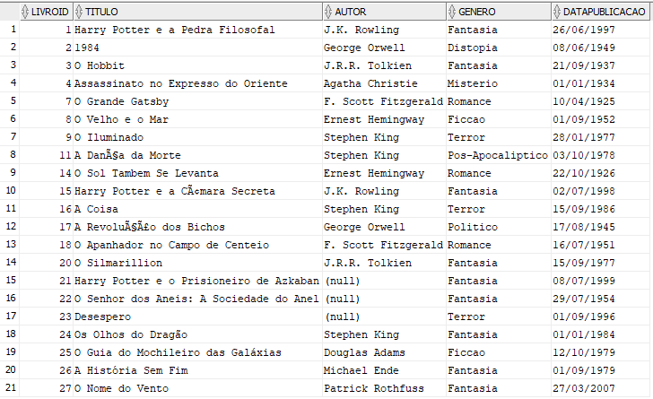

## CASO DE ESTUDO 1 
Você trabalha na biblioteca da sua cidade, fazendo o suporte de TI e gerenciando o banco de 
dados da biblioteca. A biblioteca gerencia seu acervo utilizando uma tabela Livros. Nela estão 
cadastrados o título, autor, gênero e data da publicação dos livros da biblioteca. Analise as 
situações abaixo, gerando comandos SQL para realizar as atividades solicitadas a você. Os 
comandos de criação da tabela e inserção dos registros estão no material de apoio. 


#
### Questão 1
A biblioteca quer descobrir os gêneros mais populares para promover os livros corretos. Liste 
os gêneros e a quantidade contida em cada gênero, limitando a pesquisa aos cinco gêneros 
com mais livros na biblioteca. A coluna que contém a número de livros no gênero deve ser 
mostrada como "Quantidade”.

### Resposta
```sql
SELECT
    lv.genero,
    COUNT(*) AS quantidade
FROM
    livros lv
GROUP BY
    lv.genero
ORDER BY
    2 DESC
FETCH FIRST 5 ROWS ONLY;
```

### Saída no Oracle SQL Developer

#


### Questão 2
Acontecerá na cidade um evento temático para as décadas de 70, 80 e 90. A biblioteca irá 
participar levando exemplares do seu acervo que foram publicados nestas décadas. Liste o título, 
o autor e a data de publicação de todos os livros publicados entre as décadas de 1970 e 1990, 
ordenando do mais antigo para o mais novo. Traga a coluna do nome do livro como "Nome do 
Livro" e a coluna de data de publicação como "Data de Publicacao". Ignore os livros onde o Autor 
é nulo.


### Resposta
```sql
SELECT
    lv.titulo,
    lv.autor,
    lv.datapublicacao
FROM
    livros lv
WHERE
    lv.datapublicacao BETWEEN '01.01.1970' AND '31.12.1999'
    AND NOT lv.autor IS NULL
ORDER BY
    lv.datapublicacao DESC;
```

### Saída no Oracle SQL Developer

#


### Questão 3
Houve uma determinação do Governo do Estado que todos os livros publicados antes de 1900
devem ser enviados para a capital, onde farão parte de um acervo histórico. A biblioteca enviou
os livros, e os mesmos devem ser removidos do acervo da biblioteca.

### Resposta
```sql
DELETE FROM livros lv
WHERE
    lv.datapublicacao < '01.01.1900';
```

### Saída no Oracle SQL Developer

Antes:


Depois:

#


### Questão 4
A biblioteca deseja saber a quantidade de livros por gênero, bem como o livro mais antigo e mais
novo de cada um deles. Os dados devem ser retornados em uma única consulta. Retorne a coluna
de quantidade como "Quantidade", mais antigo como "Mais Antigo" e mais novo como "Mais
Novo".

### Resposta
```sql
SELECT
    lv.genero,
    COUNT(*)               AS quantidade,
    MIN(lv.datapublicacao) AS "Mais Antigo",
    MAX(lv.datapublicacao) AS "Mais Novo"
FROM
    livros lv
GROUP BY
    lv.genero
ORDER BY
    quantidade DESC;
```

### Saída no Oracle SQL Developer

#


### Questão 5
A biblioteca recebeu uma nova coleção de livros:

Livro: Os Olhos do Dragão \
Autor: Stephen King \
Gênero: Fantasia \
Data de Publicação: 01/01/1984 


Livro: O Guia do Mochileiro das Galáxias \
Autor: Douglas Adams \
Gênero: Ficção Científica \
Data de Publicação: 12/10/1979

Livro: A História Sem Fim \
Autor: Michael Ende \
Gênero: Fantasia \
Data de Publicação: 01/09/1979

Livro: O Nome do Vento \
Autor: Patrick Rothfuss \
Gênero: Fantasia \
Data de Publicação: 27/03/2007

Faça a inserção dos registros, usando os IDs 24, 25, 26 e 27 respectivamente. Atente para o fato de que os livros devem ser 
inseridos em categorias já existentes

### Resposta
```sql
INSERT INTO livros VALUES (
    24,
    'Os Olhos do Dragão',
    'Stephen King',
    'Fantasia',
    '01/01/1984'
);

INSERT INTO livros VALUES (
    25,
    'O Guia do Mochileiro das Galáxias',
    'Douglas Adams',
    'Ficcao',
    '12/10/1979'
);

INSERT INTO livros VALUES (
    26,
    'A História Sem Fim',
    'Michael Ende',
    'Fantasia',
    '01/09/1979'
);

INSERT INTO livros VALUES (
    27,
    'O Nome do Vento',
    'Patrick Rothfuss',
    'Fantasia',
    '27/03/2007'
);
```

### Saída no Oracle SQL Developer

#
